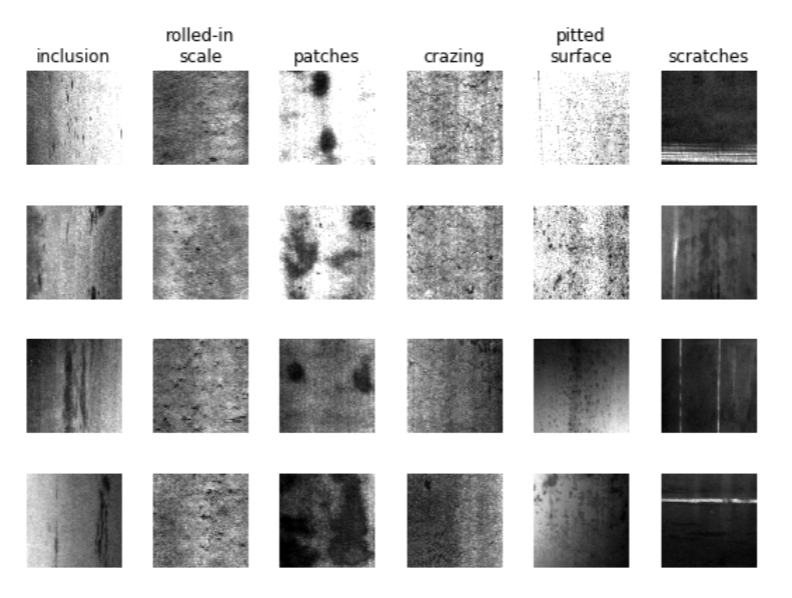

# Steel Surface Defects Classification
## Introduction

The main goal of this project is to identify and categorize common defects on steel surfaces. By leveraging deep learning techniques, the system can automatically detect and classify various types of defects, facilitating quality control processes in steel manufacturing.

## Dataset

There are 6 common defect types as shown in the image.

## Implementation/ Method

## Result

