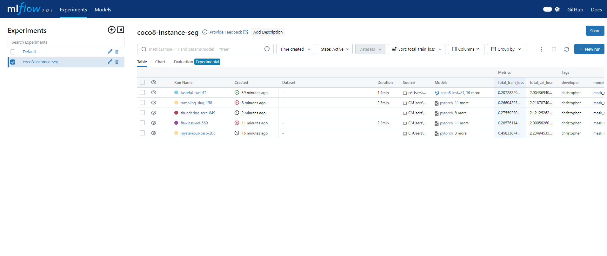
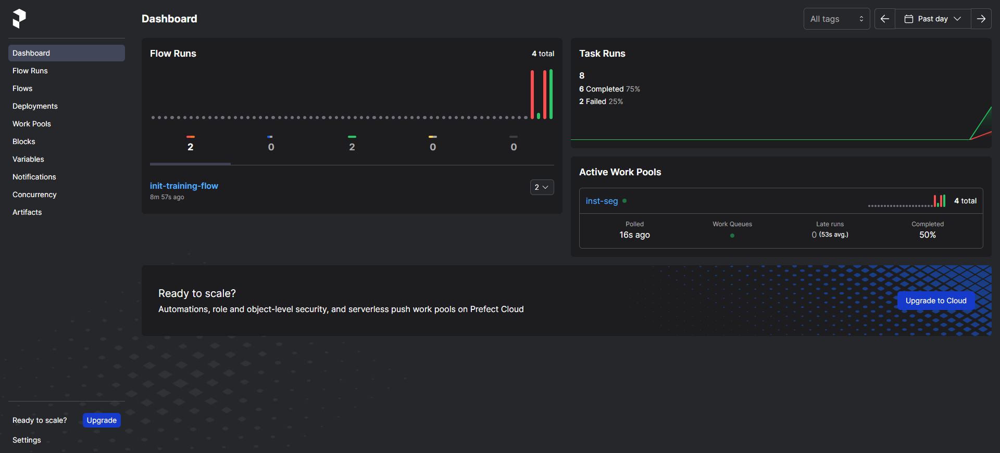

# COCO 8 - Instance Segmentation

## <ins>Introduction</ins>
This repository focuses on performing instance segmentation on a subset of the COCO dataset, specifically known as COCO 8. The COCO 8 dataset is chosen to expedite the development of other important features. Based on current state of implementation, the MLOps maturity of this repository stands at level 2. To delve deeper into the concept of MLOps maturity, please visit [Microsoft's Guide on MLOps Maturity Model](https://learn.microsoft.com/en-us/azure/architecture/ai-ml/guide/mlops-maturity-model).

## <ins>Technology/ Implementation</ins>
- The instance segmentation model is built using Torchvision's Mask RCNN FPN v2, leveraging pretrained weight.
- MLflow will be used to serve for experiment tracking.
- Prefect for orchestration.
- Grafana for visualization & model monitoring.

## <ins>MLOps for Computer Vision Operations (CVOps)</ins>
It refers to the application of Machine Learning Operations (MLOps) principles and practices to Computer Vision tasks. MLOps is a discipline that combines Machine Learning, Data Engineering, and DevOps. It aims to standardize and streamline the training, deployment, monitoring, and maintenance of machine learning models to ensure reliable and efficient operation.

In the context of Computer Vision, MLOps can involve automating the training, validation, deployment, and updating of models used for tasks such as image classification, object detection, image segmentation, etc. This can help to manage the lifecycle of these models in a systematic and scalable way, reducing manual effort and increasing the speed and quality of deployments.

## <ins>MLflow - Experiment Tracking</ins>
<ins>Start interface</ins>
<br>
Execute below command to interact with MLflow server.
<br>
```
mlflow ui --backend-store-uri sqlite:///mlflow.db
```

<ins>Log/ save model</ins>
<br>
The difference between `mlflow.pytorch.log_model()` and `mlflow.pytorch.save_model()` lies in their usage. `save_model()` is used to save a PyTorch model to a specified local path, while `log_model()` is used to log a PyTorch model to the MLflow tracking server for further tracking and versioning.

<ins>System metric</ins>
<br>
```
pip install psutil # for CPU metric. If it is already installed, skip.
pip install pynvml # for GPU metric
```
```
os.environ["MLFLOW_ENABLE_SYSTEM_METRICS_LOGGING"] = "true"
```

<ins>Model registry</ins>
<br>
For storing and versioning trained machine learning models. It also facilitates the transition of models through various stages such as `none`, `staging`, `production`, and `archive`.

- `none` > Initial stage.
- `staging` > Move model when it's ready for testing or review.
- `production` > Move model that has been tested and reviewed and is ready to be used for making actual predictions in a live application.
- `archive` > When model version is no longer in use, you can move it to this stage.

## <ins>Prefect - Orchestration</ins>
<ins>Start interface</ins>
<br>
Execute below command to interact with Prefect server.
<br>
```
prefect server start
```

<ins>Follow these steps to start orchestration</ins>
<br>
Create work pool.
<br>
```
prefect work-pool create --type process inst-seg
```

Initialize a local project.
<br>
```
prefect init --recipe local
```

Deploy workflow.
<br>
```
prefect deploy training.py:init_training_flow --name inst-seg-run --pool inst-seg
```

Workflow deployment.
<br>
```
prefect deployment run 'init-training-flow/inst-seg-run'
```

Start work pool.
<br>
```
prefect worker start --pool "inst-seg"
```

## <ins>Prefect Schedule Type</ins>
When deploying the flow, there are 3 types of schedules to choose from:

- `Cron`: This is a time-based job scheduler that uses cron expressions to schedule flows. For instance, a cron string of `"0 0 * * *"` schedules the flow to run daily at midnight.

- `Interval`: This allows for running a flow at regular intervals. By specifying the interval as a duration, Prefect runs the flow each time that duration passes. For instance, an interval schedule with a duration of one hour runs the flow every hour.

- `RRule`: This stands for "Recurrence Rule" and is a format for specifying recurring events. RRules can create more complex schedules such as calendar logic for simple recurring schedules, irregular intervals, exclusions, or day-of-month adjustments. For instance, an RRule can schedule a flow to run at 9am on every weekday.

## <ins>Grafana - Model Monitoring</ins>
Unsupervised Monitoring Metrics
- Input image width and height
- Image ratio distribution
- Image area distribution
- Inference time
- AE outlier score
- KS drift

Supervised Monitoring Metrics
- Data drift
- Concept drift
- Domain shift
- Prediction drift
- Upstream drift

## <ins>Instruction</ins>
Follow these steps to execute the COCO-8 instance segmentation project:

Step 1. Start MLflow server.
<br>
```
mlflow ui --backend-store-uri sqlite:///mlflow.db
```
Step 2. Start Prefect server.
<br>
```
prefect server start
```
Step 3. Initialize Prefect project.
<br>
```
prefect init --recipe local
```
Step 4. Deploy `training.py` and `model_registry.py` workflow: Ensure that already set up selected worker pool in Prefect.
<br>
```
prefect deploy training.py:init_training_flow --name inst-seg-run --pool inst-seg
prefect deploy model_registry.py:init_model_registry_flow --name model-registry-run --pool inst-seg
```
Step 5. Workflow deployment.
<br>
```
prefect deployment run 'init-training-flow/inst-seg-run'
prefect deployment run 'init-model-registry-flow/model-registry-run'
```
Step 6. Start work pool.
<br>
```
prefect worker start --pool "inst-seg"
```
## <ins>Result</ins>

MLflow experiment tracking result.


Prefect orchestration result.


## <ins>Issue/ Challenge</ins>
`mlflow==2.12.1` currently support `torch==2.1.2+cu118` and `torchvision==0.16.2+cu118`.

`mlflow.pytorch` appears to have compatibility with PyTorch Lightning instead of Torchvision, additional code for MLflow need to be worked with Torchvision.

## <ins>To-Do List</ins>
| No | Task                                              | Complete |
| --- | ------------------------------------------------- | ---- |
| 1 | Validation loss | &check; |
| 2 | COCO evaluation | &check; |
| 3 | Evaluation metrics - Precision, recall, mAP50, mAP50-95 (Bounding box) | &check; |
| 4 | Evaluation metrics - Precision, recall, mAP50, mAP50-95 (Segmentation) | &cross; |
| 5 | Confusion matrix/ metric | &cross; |
| 6 | Precision recall curve | &cross; |
| 7 | Precision confidence curve | &cross; |
| 8 | Recall confidence curve | &cross; |
| 9 | F1 confidence curve | &cross; |
| 10 | Early stopping | &cross; |
| 11 | Fitness evaluation metric | &cross; |
| 12 | `Production` transition by comparing `Stagging` models | &cross; |
| 13 | Soft-dice Loss | &cross; |
| 14 | Dice coefficient metric | &cross; |
| 15 | Model monitoring | &cross; |