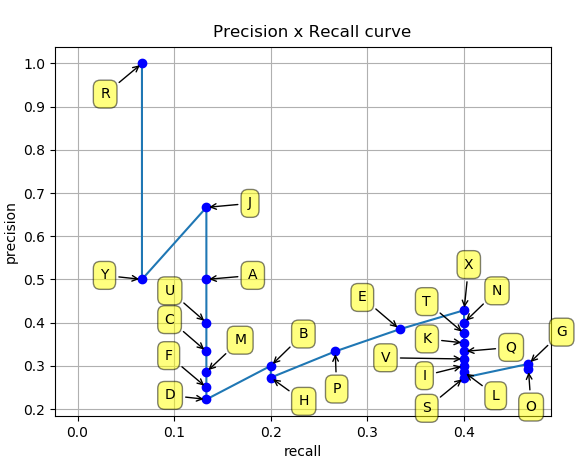
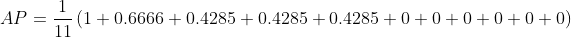
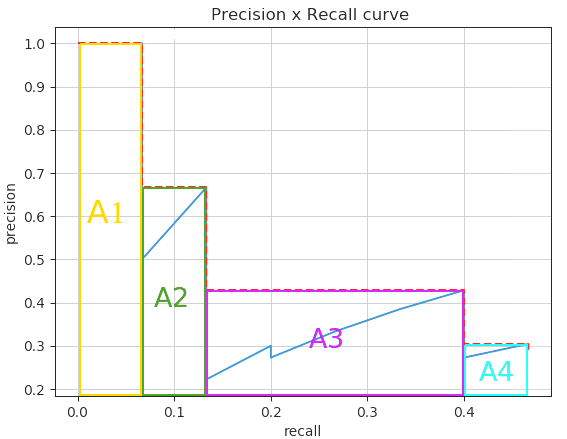

# Object Detection (PyTorch)

## <ins>Introduction</ins>
This project was solely dedicated to evaluating the performance of a two-stage object detection model built using PyTorch, with a focus on evaluation metrics such as precision, recall, and mean Average Precision (mAP), etc. The dataset used for this project, available at [Roboflow Aerial Maritime Dataset](https://universe.roboflow.com/jacob-solawetz/aerial-maritime), was intentionally kept small to expedite development and testing. This dataset contains 74 images of aerial maritime, consisting of `moveable-objects`, `lift`, `dock`, `boat`, `jetski`, and `car`.

## <ins>Evaluation Metric</ins>
### Validation/ Training Loss
Validation and training loss are key metrics to monitor during training.
- Training Loss: Measures how well the model learns from training data.
- Validation Loss: Assesses how well the model generalizes to unseen data.

If training loss decreases while validation loss increases, the model is `overfitting`. If both remain high, the model is `underfitting`. Monitoring these helps ensure balanced learning and generalization.

However, `torchvision` framework do not directly compute or produce validation loss during training. To address this, custom functions and tweaks to the code are implemented. For reference, this [StackOverflow](https://stackoverflow.com/questions/71288513/how-can-i-determine-validation-loss-for-faster-rcnn-pytorch) thread provides guidance on computing validation loss for Faster R-CNN in PyTorch.

### Intersection Over Union (IoU)

 Measurement based on Jaccard Index, is used to measure the overlap between two bounding boxes, typically a ground truth bounding box and a predicted bounding box. By calculating the IoU, we can determine whether a detection is valid (True Positive) or invalid (False Positive).

Basic Concept for Precison Recall Curve (Confusion Matrix)
- True Positive (TP): A correct detection. Detection with IoU ≥ threshold.
- False Positive (FP): A wrong detection. Detection with IoU < threshold.
- False Negative (FN): A ground truth not detected.
- True Negative (TN): Does not apply. It means possible bounding boxes that were corrrectly not detected or should not be detected within an image.

Threshold is usually set to 50%, 75% or 95%.

### Confidence
- Refers to the model's certainty that a detected object is correctly identified. 
- The score between 0 and 1.

### Precision
- The accuracy of the detected objects, indicating how many detections were correct.
- Consider important if want to minimizing false detections.

Precision = TP/ (TP + FP) = TP/ All Detection

### Recall
- The ability of the model to identify all instances of objects in the images.
- Consider important if want to detect every instances of an object.

Recall = TP/ (TP + FN) = TP/ All Ground Truth

### F1 Score
Balance between precision and recall/ harmonic mean of precision and recall. Providing a balanced assessment of a model's performance while considering both false positives and false negatives.

### Precision Recall Curve
Illustrates the trade-off between precision and recall as the confidence threshold for detecting objects is varied. Object detectors are often judged by their ability to achieve `high precision` (minimize false positives)/ achieve `high recall` (minimize false negatives).

- Good object detector: Maintain high precision as recall increasing.
- Poor object detector: Rapid drop in precision as recall increasing.

### Average Precision (AP)
- Compute the area under the `precision-recall curve`, providing a single value that encapsulates the model's precision and recall performance. 
- Summarize the `precision-recall curve` into a single metric by calculating the area under the PR curve.
- High `AP` values indicate that the detector performs well across all levels of recall and precision.

### Mean Average Precision (mAP)
Extend the concept of AP by calculating the average `AP` values across `multiple` object classes, useful in `multi-class` object detection scenarios to provide a comprehensive evaluation of the model's performance.

### Mean Average Precision 50 (mAP50)
- Mean Average Precision (mAP) calculated at an Intersection over Union (IoU) threshold of 0.50 (IoU ≥ 0.50).
- Any predictions with an IoU below 50% are False Positive (FP).
- Help evaluate a model's basic detection ability without requiring strict accuracy.

### Mean Average Precision 50-95 (mAP50-95)
- Comprehensive measure of a model's performance in object detection, average the mean average precision (mAP) calculated at multiple IoU thresholds.
- Example, 0.50, 0.55, 0.60, ..., 0.95.

### Step-by-Step Guide to Calculate Average Precision (AP)
1. Gather Predictions and Ground Truths
    - Predictions: Coordinates (x, y, w, h), Confidence Score & Predicted Class Label.
    - Ground Truths: Ground-truth Bounding Boxes and their class labels.
2. Match Predictions to Ground Truths
    - Use Intersection over Union (IoU) to determine whether a predicted box matches a ground-truth box.
    - Define an IoU threshold: (0.5, 0.7, 0.9).
    - Matching rules: TP, FP, FN.

3. Sort Predictions by Confidence
    - For each class, sort all predictions by their confidence score in descending order.

4. Compute Precision and Recall
    - Count TPs and FPs cumulatively.
    - Calculate Precision and Recall.
    - Precision = Cumulative TPs / (Cumulative TPs + Cumulative FPs)
    - Recall = Cumulative TPs / Total Ground Truth for the Class
​

5. Plot the Precision-Recall Curve
    - For each class, plot Precision (y-axis) vs. Recall (x-axis) to form the Precision-Recall (PR) curve.

6. Compute Average Precision (AP)
    - There are two different ways to measure the interpolted average precision. `11-point interpolation` and `interpolating all points`.

11-point Interpolation Calculation

Interpolating All Points Calculation

7. Compute mAP
    Average the AP across all classes

    

    i: Represents the index of the object classes. 
    C: Total number of classes. 
    APi: The Average Precision for the i-th class. 

    

### Mean Average Precision (mAP) Implementation
1.  `pycocotools` is used for mAP evaluation. For reference, check this [training sample](https://github.com/pytorch/vision/tree/main/references/detection) from the PyTorch repository.
2. `ultralytics` evaluation metric, commonly used in YOLO, has been implemented in this project. For more details, refer this [sample](https://github.com/ultralytics/ultralytics/blob/118edde3baf7c71e4b1765282be7ce1625699b7f/ultralytics/utils/metrics.py).

### Confusion Matrix
The `ConfusionMatrix` class has been referenced from the Ultralytics repository, an open-source implementation available on their GitHub page under the `ultralytics/utils/metrics.py` file. As the repository is a well-known and reliable source in the deep learning community, the implementation is efficient and suitable for this project. 

Link to further understand the code: https://docs.ultralytics.com/reference/utils/metrics/ 

Before the IoU and class matching operations are performed, confidence score is used to filter out detections that are not considered confident enough.
1. True Positive (TP)
    - The detection is matched with a ground truth (IoU > threshold).
    - The detection class matches the ground truth class.
2. False Positive (FP)
    - A detection either IoU < threshold or class mismatch.
3. False Negative (FN)
    - Ground truth (IoU < threshold or class mismatch).

## <ins>Result</ins>

    

Based on the `validation loss` and `training loss` data, . 

    

Based on the `precision recall curve`, average precision (AP) for different object classes at an IoU threshold of 0.5 (mAP0.5). 

1. Boat (0.171): The model has a relatively low average precision for detecting boats, meaning the model's detections for boats tend to have a low overlap with the ground truth boxes (IoU ≥ 0.5).
2. Car (0.0000): The model performed very poorly in detecting cars, likely because it failed to correctly detect any cars or the detections were very imprecise (below the 0.5 IoU threshold).
3. Docks (0.583): Fairly well in detecting docks, with a higher average precision compared to boats and cars.
4. Jetski (0.492): The model performs moderately in detecting jetskis, with an average precision close to 0.5. 
5. All Classes (0.417): The overall average precision across all object classes is 0.417 which is moderate but typically considered below average for most object detection tasks. This suggest there is room of improvement especially on `car` and `boat`.

 

    

1. True Positives (TP)
    - Values along the diagonal of the matrix (correct predictions).
    - Example: For `car`, TP = 79, as 79 instances of `car` were correctly predicted as `car`.
2. False Positives (FP)
    - Values in the same row as a given class but outside the diagonal (instances wrongly predicted as this class).
    - Example: For `car`, FP = 2 (`movable-objects`) + 7 (`jetski`) + 70 (`background`).
3. False Negatives (FN)
    - Values in the same column as a given class but outside the diagonal (instances of the class wrongly predicted as another).
    - Example: For `car`, FN = 42 (`background`) + 2 (`jetski`).

When the ground truth is `background` (there is no object present, it is a background region), but the model detects it as `jetski` (a non-background class), this would be classified as a False Positive (FP).

If there is a `class` in the ground truth, but the model predicts it as `background`, this is a False Negative (FN).

## <ins>Reference</ins>
1. https://github.com/rafaelpadilla/Object-Detection-Metrics?tab=readme-ov-file
2. https://docs.ultralytics.com/guides/yolo-performance-metrics/#interpretation-of-results
3. https://github.com/ultralytics/ultralytics